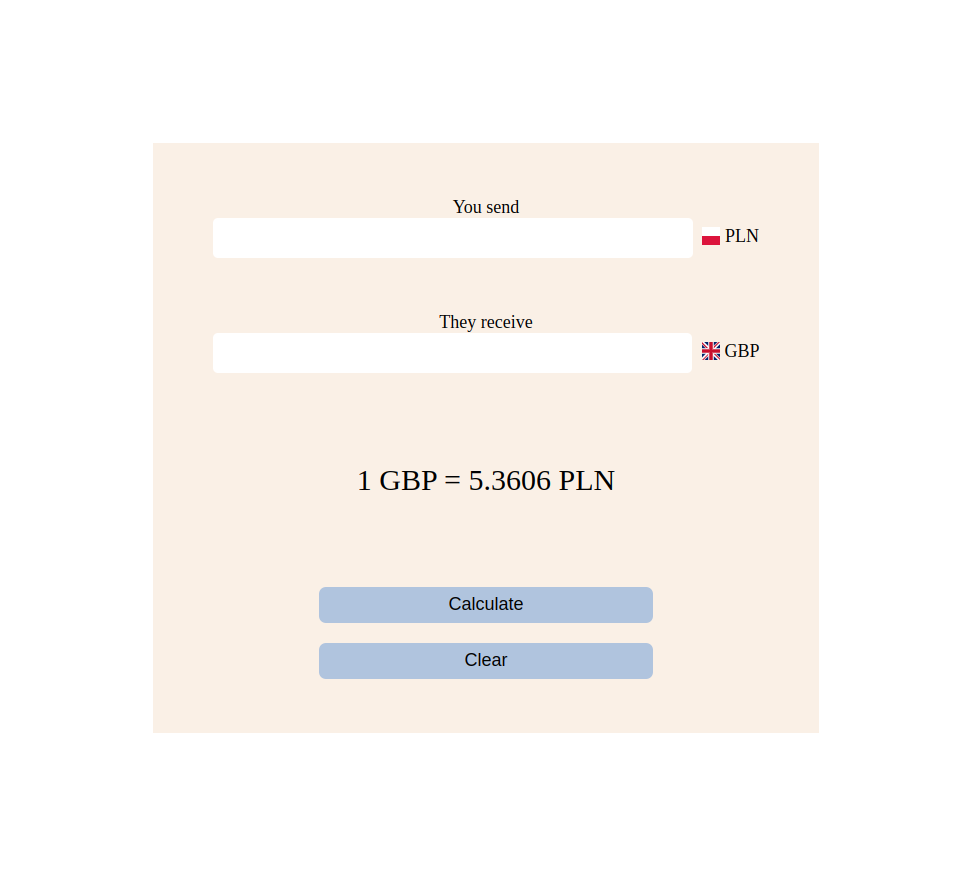

# Currency converter

Web app for converting currencies - from PLN to GBP and from GBP to PLN, according to current exchange rate fetched from NBP website.



##  Instructions

### Prerequisites

Install node.js (https://nodejs.org/en/download/).

### Installation

1. Download the project.
2. Install NPM packages - run in terminal 
```
npm install express ejs http request mocha
```
(in a directory containing the project).

### Usage

1. Run in terminal
```
node app.js
```
(in a directory containing the project).

2.  Go to http://localhost:3000/.

## Testing

Run in terminal 
```
npm test
```
(in a directory containing the project).
